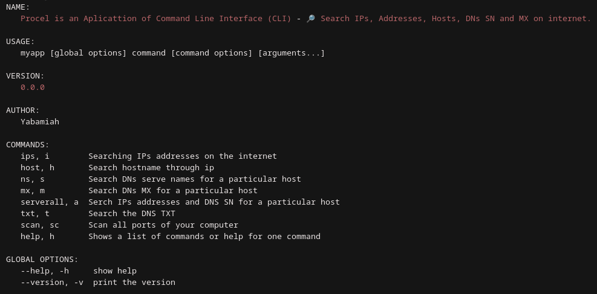

# procel
Is a tiny network CLI made in Go with urfave/cli package, which can quickly look up IPs addresses, hosts, DNS NS, MX, TXT and scan ports. 
Mainly made to train the Go language and the implementation of your packages and project organization.
<p align="center"></p>

---

## Installation

```bash
go get github.com/yabamiah/procel
```

## Examples

#### Get a IP addresses by a host link

```bash
myapp ips --host wikipedia.org
```

#### Get a Host name by IP addresses
```bash
myapp host --ip 5.255.255.50
```

#### Get a DNS NS by a host link
```bash
myapp ns --host wikipedia.org
```
#### DNS MX 
```bash
myapp mx --host wikipedia.org
```
#### DNS TXT
```bash
myapp txt --host wikipedia.org
```

#### Scan one port
```bash
myapp scan --host localhost --protocol tcp --port 8080
```
#### Scan all tcp ports
```bash 
myapp scan --host localhost --protocol tcp --all
```

#### Injects random characters in a file
```bash
myapp archive --file file.txt --size 100
```

## Quick Starting
```bash
git clone https://github.com/yabamiah/procel
cd procel
./build/myapp
```

## Contributing
I'm still new to Go, and I appreciate any kind of help!
